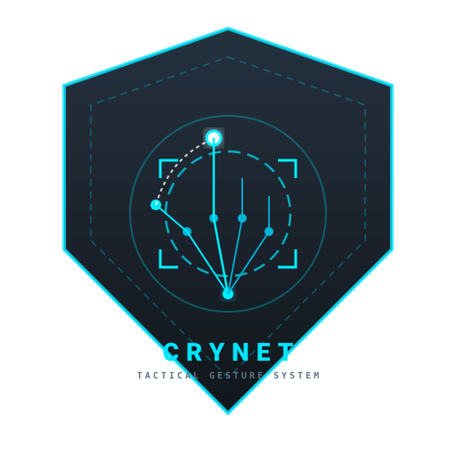

# CryNet — Tactical Hand-Gesture Control System



> **Autonomous, Offline-First, Local-Only Iron Man/JARVIS-Inspired Desktop Control System for Windows**

**Mandatory Architecture Guarantee:**
> **"After installation, CryNet does not require an internet connection to operate."**  
> CryNet operates 100% offline. It contains no telemetry, no cloud APIs, no remote AI model calls, no analytics, and no network traffic at runtime. All computer vision and landmark inference execute locally on your machine via bundled CPU/GPU pipelines.

---

## 1. What CryNet Does

CryNet converts live laptop webcam video into precision mouse, keyboard, scrolling, drag-and-drop, and window navigation commands. Designed for power users, developers, and presentation environments, CryNet allows full touchless computer interaction with an aesthetic inspired by sophisticated tactical HUD interfaces.

### Key Capabilities:
- **Continuous Virtual Cursor Control**: Point and navigate with your index finger fingertip with exponential smoothing and tremor dead-zone filtering.
- **Natural Discrete Pinch-to-Click**: Touch thumb and index finger to trigger clean single left clicks without repeated misfires.
- **Seamless Drag-and-Drop**: Hold the pinch contact and move your hand to drag files, windows, or sliders; release to drop.
- **Two-Finger Fluid Scrolling**: Extend index and middle fingers to smoothly scroll web pages and code documents up and down.
- **Directional Navigation Swipes**: Fast horizontal hand flicks send `Alt + Left` (Back) and `Alt + Right` (Forward) browser/IDE navigation commands.
- **Tactical JARVIS HUD**: A transparent, always-on-top, draggable overlay showing real-time FPS, gesture telemetry, and confidence.
- **Dual Automatic Modes**:
  - **HOME MODE**: 1-display laptop setup with targeted calibrated workspace.
  - **OFFICE MODE**: 2+ displays with dynamic monitor detection, negative coordinate support, and target screen routing.

---

## 2. Gesture Controls Reference Matrix

| Gesture | Hand Posture | Action Triggered | Safety Behavior |
| :--- | :--- | :--- | :--- |
| **Cursor** | Index finger extended; other fingers folded | Moves virtual cursor smoothly | Dead-zone ignores micro-tremors |
| **Pinch** | Thumb & index fingertips touching (`< 0.045`) | Single Left Mouse Click | Exactly 1 click on contact; no loop clicks |
| **Pinch + Move** | Thumb & index held together while moving | Mouse Drag (Mouse Down + Move) | Clean Mouse Up upon finger release |
| **Two-Finger Scroll**| Index + Middle extended; Ring & Pinky folded | Vertical Mouse Wheel Scrolling | Dead-zone prevents accidental drift |
| **Open Palm** | All 5 fingers extended and spread | **Emergency Gesture Pause** | Halts actions; displays `GESTURE CONTROL PAUSED` |
| **Fist** | All fingers folded | Neutral Posture | Safe resting state; no action dispatched |
| **Swipe Left** | Rapid horizontal hand flick to the left | `ALT + LEFT` (Navigate Back) | Velocity threshold prevents misfires |
| **Swipe Right** | Rapid horizontal hand flick to the right | `ALT + RIGHT` (Navigate Forward)| Cooldown prevents multiple triggers |

---

## 3. Safety Architecture & Fail-Safes

Safety is a core design pillar of CryNet. The system enforces strict fail-safes:

1. **Global Emergency Kill-Switch (`ESC`)**: Pressing `ESC` at any time immediately releases all mouse buttons, clears velocities, and forces CryNet into `STANDBY`.
2. **Global Control Toggle (`F8`)**: Enables or disables active gesture execution globally. When disabled, CryNet remains in passive `STANDBY`.
3. **Open Palm Safety Intercept**: Spreading an open palm instantly triggers an immediate action lock (`GESTURE CONTROL PAUSED`).
4. **Multi-Hand Protection**: If two hands enter the optical frame simultaneously, gesture dispatching pauses automatically to prevent conflicting inputs.
5. **Display Disconnection Sentinel**: If an external monitor is unplugged while set as the target, CryNet immediately detects the lost display and enters safe standby (`TARGET DISPLAY LOST`).
6. **Destructive Command Blacklist**: No gesture can execute system reboots, shutdowns, deletions, terminal formatting, or file operations.

---

## 4. Multi-Monitor Coordinate System (HOME vs. OFFICE)

CryNet does not assume displays are arranged linearly or share resolutions:
- Windows Virtual Desktop coordinates (`SM_XVIRTUALSCREEN`, `SM_YVIRTUALSCREEN`, `SM_CXVIRTUALSCREEN`, `SM_CYVIRTUALSCREEN`) are queried directly.
- Handles asymmetric layouts (e.g., external monitor above or to the left of the laptop with negative coordinates).
- Handles different DPI scaling factors without coordinate warping.

### Workflow: Home to Office
1. **At Home (Single Display)**:
   - CryNet launches in **HOME MODE**.
   - Target display defaults to `Display 1 (Laptop)`.
   - Run the 4-Corner Calibration Wizard once to establish your comfortable reach boundary.
   - Settings persist locally in `config/calibration.json`.
2. **At Office (External Monitors Connected)**:
   - Connect HDMI / USB-C / DisplayPort cable.
   - CryNet automatically detects the new display count and switches to **OFFICE MODE**.
   - Select your target monitor from the dropdown (e.g., `Display 2 — External (2560x1440)`).
   - Gestures are routed directly to the selected display without needing to rebuild or restart the application.

---

## 5. 4-Corner Calibration Wizard

Camera lenses capture wide angles, but you shouldn't have to reach the physical edges of your webcam frame to reach the edges of your screen.

Launch the **Calibration Wizard** from the Dashboard or Display tab:
1. **Step 1/4**: Move your index finger to the top-left corner of your comfortable hand reach → Press **Space** or click **Confirm**.
2. **Step 2/4**: Move to top-right corner → Confirm.
3. **Step 3/4**: Move to bottom-left corner → Confirm.
4. **Step 4/4**: Move to bottom-right corner → Confirm.
5. **Saved**: The normalized boundaries `[min_x, min_y, max_x, max_y]` are saved to `config/calibration.json` and applied instantly.

---

## 6. Installation & Offline Verification

### Prerequisites
- Windows 10 or Windows 11 (64-bit)
- Python 3.11 or Python 3.12
- Standard USB or Integrated Webcam

### Setup Steps
```powershell
# 1. Clone or extract CryNet to your workspace
cd c:\Users\biren\Downloads\Iron-man

# 2. Create virtual environment
py -3.12 -m venv venv

# 3. Activate virtual environment
.\venv\Scripts\Activate.ps1

# 4. Install dependencies
pip install -r requirements.txt

# 5. Launch CryNet
python main.py
```

### Testing Offline Operation
1. Disconnect your machine from Wi-Fi and unplug Ethernet.
2. Launch CryNet: `python main.py`
3. Notice instantaneous startup: camera initializes, MediaPipe loads locally, and HUD renders without requesting any network connection.

---

## 7. Packaging into a Standalone Windows Executable

CryNet includes a complete build script utilizing PyInstaller:

```powershell
.\venv\Scripts\python.exe build.py
```

This compiles:
```
dist/
└── CryNet/
    ├── CryNet.exe       # Standalone executable
    ├── config/          # Local JSON configurations
    ├── mediapipe/       # Local model weights & C++ binaries
    └── PySide6/         # Qt UI runtime libraries
```

You can copy the `dist/CryNet` folder to a flash drive and run it on any Windows laptop without Python or an internet connection.

---

## 8. Hotkeys & Controls Summary

- **`F8`**: Global Toggle (Standby ⟷ Online)
- **`ESC`**: Global Emergency Stop (Halts input immediately)
- **`F7`**: Toggle JARVIS HUD Overlay
- **`Space / Enter`**: Confirm Calibration Step (Inside Calibration Wizard)

---

## 9. Security & Privacy Model

- **Zero Cloud Traffic**: Zero telemetry, telemetry hooks, or analytics scripts.
- **Zero Frame Archiving**: Camera frames are processed strictly in RAM and immediately overwritten; no video or photos are saved to disk.
- **Least Privilege**: Runs completely in user-space; administrator privileges are neither requested nor required.
- **No Dynamic Code Execution**: No `eval()`, `exec()`, or external shell injections.

## Troubleshooting: Camera Works but Gesture Matrix Says HAND DETECTED: NO

If the webcam opens but the Gesture Matrix never changes from `HAND DETECTED: NO`, check `logs/crynet.log` for a MediaPipe initialization error.

CryNet currently uses the legacy `mp.solutions.hands` API, so the project pins **MediaPipe 0.10.21**. Do not let pip upgrade MediaPipe to 1.x.

Repair the environment:

```powershell
.\venv\Scripts\python.exe -m pip uninstall mediapipe -y
.\venv\Scripts\python.exe -m pip install -r requirements.txt
```

Then rebuild the executable:

```powershell
.\venv\Scripts\python.exe build.py
```

The rebuilt `dist\\CryNet\\CryNet.exe` must be used for the offline test.
